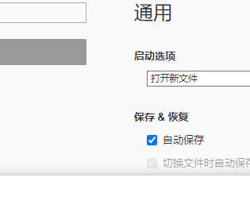
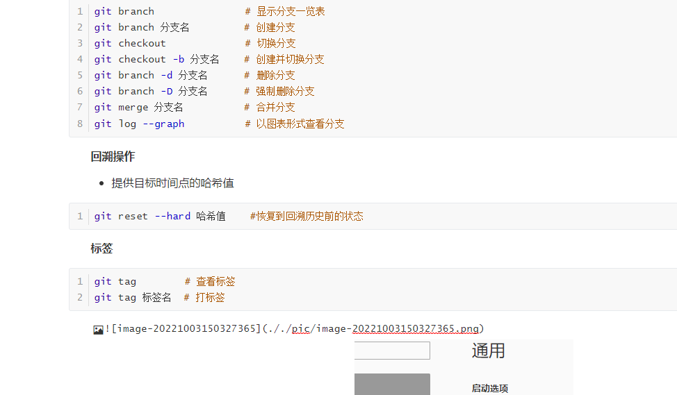

### 1. Git初始配置

**设置姓名和邮箱地址**

```shell
git config --global user.name "github的名字"
git config --global user.email "注册github的邮箱"
```

**提高命令输出的可读性**

```shell
git config --global color.ui auto
```

### 2. Git与GitHub绑定

**本地设置SSH Key**

- 打开 GitBash ，输入ssh，检查SSH是否安装

-  输入**ssh-keygen -t rsa**，回车3次，生成id_rsa (密钥)和 id_rsa.pub(公钥)

**GitHub添加SHH Key**

- 打开 GitHub，点击右上角的你的头像，点击设置 **settings**
- 点击左侧**SSH and GPG keys**，点击右上角 **New SSH key**
- 将生成的公钥 (id_rsa.pub 文件中的内容)复制到**Key**所在框（Title不用填）
- 点击下方的 **Add SSH key** 按钮

**验证绑定**

- GitBash中输入 **ssh -T git@github.com** ，返回successfully。

### 3. Git基本操作

**初始化仓库**

```shell
git init
```

**查看仓库的状态**

```shell
git status
```

**向暂存区中添加文件**

```shell
git add  文件名/文件夹名
```

**保存仓库的历史记录**

```shell
git commit -m "提交信息"    # 提交一行信息
git commit                # 提交详细信息
git commit --amend        # 修改提交信息
```

**查看提交日志**

- 打印Git仓库提交日志（作者、时间、提交信息）

```shell
git log      # 查看以当前状态为终点的历史日志
git reflog   # 查看当前仓库的操作日志
```

**查看更改前后的差别**

```shell
git diff          # 查看工作树和暂存区的差别
git diff HEAD     # 查看工作树和最新提交的差别
```

**下载远程仓库**

- HTTPs格式URL：文件修改后，再次提交GitHub远程服务器时，需要账号与密码
- SSH 格式URL：SSH Keys 授权，不需要用户名和密码

```shell
git clone https格式URL
git clone SSH格式URL
```

**本地与远程仓库交互**

- git push：本地代码更新时，需将本地推到远程仓库
- git pull：远程仓库更新时，需把远程拉到本地进行合并

```shell
git push origin main    # 将本地代码推到远程 main 分支
git pull origin mian    # 将远程最新的代码更新到本地
```

**分支操作**

- **git branch：**显示分支一览表  （“ * ”：表示当前所在分支）
- **git checkout：**切换分支
- **git merge：**合并分支（合并前，先切换到主分支）
- **git log --graph**：以图表形式查看分支

```shell
git branch        		 # 显示分支一览表
git branch 分支名         # 创建分支
git checkout             # 切换分支
git checkout -b 分支名    # 创建并切换分支
git branch -d 分支名      # 删除分支
git branch -D 分支名      # 强制删除分支
git merge 分支名          # 合并分支
git log --graph          # 以图表形式查看分支
```

**回溯操作**

- 提供目标时间点的哈希值

```shell
git reset --hard 哈希值    #恢复到回溯历史前的状态
```

**标签**

```shell
git tag        # 查看标签
git tag 标签名  # 打标签
```




